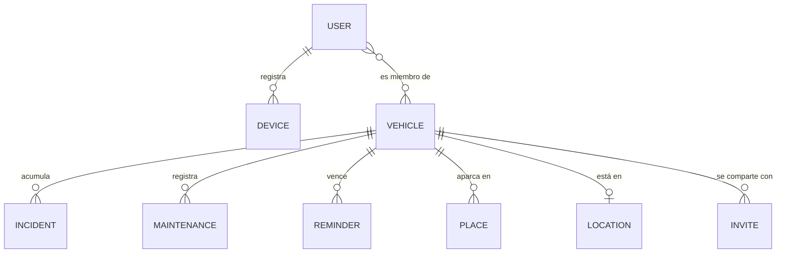

# Modelo de datos — diseño objetivo

Este documento describe **a dónde va** el modelo de datos de AparK, no dónde está hoy. Está
escrito como se diseñaría de cero sabiendo todo lo que la app va a necesitar
(ver [ROADMAP.md](ROADMAP.md)), para que cada spec que llegue pueda comprobar contra qué encaja.

---

## 1. El método

Diseñar para Firestore **no** es diseñar para SQL y luego traducir. El orden correcto es:

```
1. Modelo conceptual        entidades y relaciones (esto sí es igual que en SQL)
2. Patrones de acceso       qué lee y escribe cada pantalla, con qué frecuencia
3. Disposición              colecciones y subcolecciones, derivadas del paso 2
4. Desnormalización         solo la que exija un patrón concreto del paso 2
5. Reglas                   a la vez que el modelo, porque lo restringen
6. Índices                  comprobar que cada consulta del paso 2 tiene uno
```

En SQL modelas el dominio y luego consultas como quieras. **En Firestore diseñas alrededor de las
consultas**, porque el motor solo sabe hacer lo que el índice le permite y la regla le autoriza.

### Las dos leyes que lo gobiernan todo

1. **Las reglas no hacen joins.** Todo campo por el que necesites autorizar tiene que estar en el
   propio documento. Comprobar el padre es posible con `get()`, pero **cuesta una lectura
   facturada** por evaluación.
2. **Una consulta se acepta solo si sus filtros demuestran por sí solos que es segura.** No basta
   con que el resultado fuese legal: Firestore lo verifica *antes* de ejecutarla.

De la ley 1 sale `memberIds`. De la ley 2 sale que la lista de vehículos se obtenga con
`array-contains` y no con una lista de ids guardada aparte.

---

## 2. Modelo conceptual



La relación que manda es **usuario ↔ vehículo, de muchos a muchos**. Todo lo demás cuelga del
vehículo. No existe (todavía) el concepto de *hogar* o *grupo*: ver la sección 7.

---

## 3. Patrones de acceso

Este es el paso que decide el diseño. **Cliente:**

| # | Patrón | Frecuencia | Tiempo real |
|---|--------|-----------|-------------|
| R1 | Mis vehículos, en mi orden, con su ubicación actual | cada arranque | **sí** |
| R2 | Detalle de un vehículo | media | sí |
| R3 | Incidencias abiertas de un vehículo | media | sí |
| R4 | Incidencias abiertas de **todos** mis vehículos | baja | no |
| R5 | Historial de mantenimiento de un vehículo | baja | no |
| R6 | Próximos vencimientos (ITV) de mis vehículos | baja | no |
| R7 | Miembros de un vehículo | baja | no |
| R8 | Ubicaciones predeterminadas de un vehículo | baja | no |
| W1 | **Aparcar** (escribir ubicación actual) | **la más frecuente** | — |
| W2 | Reportar / resolver una incidencia | media | — |
| W3 | Crear, unirse, salirse, reordenar | baja | — |

**Servidor (Cloud Functions, con Admin SDK):**

| # | Patrón | Disparo |
|---|--------|---------|
| S1 | Cascada al borrar un vehículo | trigger |
| S2 | Notificar al resto cuando alguien aparca | trigger |
| S3 | Notificar cambios de incidencia | trigger |
| S4 | **Buscar vencimientos próximos en todos los vehículos** | programado |
| S5 | Cascada al borrar una cuenta | callable |

> **S4 es el que rompe los diseños ingenuos.** Obliga a una *consulta de grupo de colección* sobre
> `reminders`. Lo que lo hace fácil es que corre con el Admin SDK, que **se salta las reglas**: no
> necesita ninguna desnormalización de seguridad, solo un índice de grupo sobre `dueDate`.
>
> Lección general: **los patrones de servidor tienen restricciones distintas a los de cliente.** No
> desnormalices por seguridad algo que solo va a leer una función.

---

## 4. Disposición

```
users/{uid}
  email, displayName, photoUrl
  settings: { locale, theme, notifications: { parked, incidents, reminders } }
  vehicleOrder: [vehicleId]           # SOLO pista de ordenación, jamás la fuente de la lista
  createdAt, updatedAt, schemaVersion

users/{uid}/devices/{deviceId}        # deviceId determinista → registrar es idempotente
  fcmToken, platform, appVersion, lastSeenAt

vehicles/{vehicleId}
  name, licensePlate
  type, make, model, year, fuel, color
  ownerId                             # quién puede borrar y compartir
  memberIds: [uid]                    # para CONSULTAR y para las REGLAS
  members: { uid: { role, displayName, joinedAt } }   # para PINTAR sin leer N usuarios
  currentLocation: {
    lat, lng, at, by: { uid, displayName },
    placeId?, placeName?, source: "gps" | "manual" | "place"
  }
  createdAt, updatedAt, createdBy, schemaVersion

vehicles/{vehicleId}/incidents/{incidentId}
  vehicleId                           # redundante a propósito: ver decisión 4
  type, title, notes
  status: "open" | "resolved"
  reportedBy: { uid, displayName }, reportedAt
  resolvedBy?, resolvedAt?
  createdAt, updatedAt, schemaVersion

vehicles/{vehicleId}/maintenance/{recordId}
  vehicleId, type, performedAt, odometerKm?, cost?, currency?, workshop?, notes
  createdBy, createdAt, updatedAt, schemaVersion

vehicles/{vehicleId}/reminders/{reminderId}
  vehicleId, kind: "itv" | "insurance" | "service" | "tax" | "custom"
  dueDate                             # índice de grupo de colección — lo usa S4
  recurrence, lastNotifiedAt?
  createdBy, createdAt, updatedAt, schemaVersion

vehicles/{vehicleId}/places/{placeId}
  label, icon: "garage" | "home" | "work" | "other"
  lat, lng
  createdBy, createdAt, updatedAt, schemaVersion

invites/{code}                        # el cliente no lo toca: solo Cloud Functions
  vehicleId, createdBy, createdAt, expiresAt, usedBy?, usedAt?
```

---

## 5. Las decisiones, y por qué

### 1. La pertenencia se guarda **dos veces**, con dos papeles distintos

`memberIds: [uid]` es un array **para consultar y autorizar**. `members: {uid: {...}}` es un mapa
**para pintar**. Parece duplicación y no lo es: son dos patrones de acceso distintos.

- Sin el array no hay `array-contains`, y sin `array-contains` no hay consulta segura (ley 2).
- Sin el mapa, pintar "aparcado por Marta" exige **una lectura por miembro**. Con él, la tarjeta se
  dibuja con el documento que ya tienes.

El precio es mantener los dos sincronizados, y por eso (decisión 3) los escribe solo el servidor.

### 2. El orden vive en el usuario, y **no** es la fuente de la lista

`vehicleOrder` es una **pista**. La lista sale de la consulta; los ids que sobran se ignoran y los
vehículos que faltan van al final. Así un id colgante deja de ser un bug y pasa a ser ruido.

Es la lección de [spec 008](specs/008-vehicle-membership-model/spec.md), y merece enunciarse como
regla general: **un dato derivable no debe ser también la fuente de la verdad.**

### 3. Los datos de autorización los escribe el servidor, nunca el cliente

`ownerId`, `memberIds` y `members` son **datos de seguridad**. Un cliente que pueda escribirlos
puede meter o sacar a gente. Las reglas los deniegan y las mutaciones van por callables
(`joinVehicleWithCode`, `leaveVehicle`, `transferOwnership`).

Regla general: **si un campo decide quién puede leer algo, no puede escribirlo quien es leído.**

### 4. Las subcolecciones llevan `vehicleId` aunque sea redundante

Cuesta nada y es la puerta a las consultas de grupo de colección (R4, S4). Sin él, el día que
quieras "todas las incidencias abiertas" tienes que reescribir documentos existentes.

**Pero no se desnormaliza `memberIds` en los hijos todavía.** Haría falta solo para que R4 fuese
*una* consulta desde el cliente, y obliga a una función que reescriba todos los hijos cada vez que
alguien entra o sale. Con ≤10 vehículos, R4 se resuelve con N consultas pequeñas.

> Principio: **paga la desnormalización cuando exista la consulta, no cuando la imagines.**

### 5. Contadores: primero `count()`, y solo después desnormalizar

Para la chapita de "3 incidencias abiertas", la respuesta por defecto es la **consulta de
agregación** `count()`: siempre correcta, sin nada que mantener. Un contador desnormalizado en el
vehículo se lee gratis, pero **es un pasivo de consistencia** — se desincroniza y hay que
repararlo. Solo se justifica si acaba en la ruta caliente y medida.

### 6. La ubicación actual va **incrustada**, y minimizada

R1 tiene que pintar la tarjeta con lo que ya ha leído: si la ubicación fuese otro documento, cada
arranque costaría el doble de lecturas. Va dentro del vehículo.

Ahora bien, **incrustada no quiere decir entera**: `by` guarda `{uid, displayName}` y nada más. Hoy
se guarda el objeto `User` completo, `userVehicles` incluido, lo que filtra a los demás miembros la
lista de ids de tus otros vehículos.

> Principio: **una copia desnormalizada guarda lo que la pantalla pinta, no el objeto de origen.**

El historial (`parkingEvents`) es otra cosa y llega cuando haya una pantalla que lo pida.

### 7. IDs deterministas donde exista clave natural

`users/{uid}` ya lo hace. `devices/{deviceId}` también debe: si el id sale del token o del
installation id, registrar el dispositivo es **idempotente** y no genera duplicados al reintentar.
Auto-id solo cuando no hay clave natural (vehículos, incidencias).

### 8. Campos comunes en todo documento

`createdAt`, `updatedAt`, `createdBy` y **`schemaVersion`**. El último es el que la gente omite y el
que permite migrar por partes: un cliente viejo puede detectar un documento que no entiende, y una
migración puede avanzar por lotes sabiendo qué le falta por tocar.

---

## 6. Reglas e índices

### Reglas

Sobre el propio vehículo no hace falta leer nada — el campo está en el documento:

```
allow read: if request.auth.uid in resource.data.memberIds;
```

Sobre las subcolecciones hay que mirar al padre, y **cada `get()` es una lectura facturada**
(cacheada dentro de una misma petición):

```
function isMember(vid) {
  return request.auth != null
      && request.auth.uid in get(/databases/$(database)/documents/vehicles/$(vid)).data.memberIds;
}
```

Se acepta ese coste a esta escala. La alternativa —copiar `memberIds` en cada hijo— se compra
cuando duela, no antes (decisión 4).

### Índices

| Patrón | Índice |
|--------|--------|
| R1 `vehicles where memberIds array-contains uid` | automático de campo único |
| R3 `incidents where status == open order by createdAt` | **compuesto** (status, createdAt) |
| R5 `maintenance order by performedAt` | automático |
| S4 `collectionGroup(reminders) where dueDate <= X` | **grupo de colección** sobre `dueDate` |
| R4 `collectionGroup(incidents) …` | pendiente, solo si se implementa |

Todos deben acabar versionados en `firestore.indexes.json`, que hoy está vacío.

---

## 7. Lo que deliberadamente NO se hace

- **No hay entidad `household` / `group`.** Sería el modelado "correcto" para que un garaje se
  comparta entre vehículos, pero implica **un segundo sistema de permisos** en paralelo al de
  vehículos. Las ubicaciones cuelgan del vehículo, y el nombre del sitio se copia dentro de
  `currentLocation` para que la tarjeta lo pinte sin otra lectura. Si algún día aparece el grupo,
  las ubicaciones se mudan y las copias históricas siguen leyéndose bien.
- **No hay `parkingEvents`** hasta que haya pantalla que lo use.
- **No hay contadores desnormalizados** hasta que `count()` se quede corto y esté medido.
- **No hay borrado lógico.** El borrado de un vehículo es real, con cascada en el servidor.

---

## 8. Distancia con lo que hay hoy

| Hoy | Objetivo | Dónde |
|-----|----------|-------|
| `userVehicles` es la fuente de la lista | `memberIds` + `vehicleOrder` como pista | spec 008 |
| `sharedUsers` + `ownerId` | `memberIds` + `members` + `ownerId` | spec 008 |
| Sin marcas de tiempo | `createdAt` / `updatedAt` / `schemaVersion` | spec 008 |
| `lastLocation.user` guarda un `User` entero | `by: {uid, displayName}` | spec 008 |
| `inviteCode` muerto en el vehículo | eliminado | spec 008 |
| Sin metadatos de vehículo | `type`, `make`, `model`, `year`, `fuel` | fase 2 |
| Sin subcolecciones | `incidents`, `maintenance`, `reminders`, `places` | fase 3 |
| Sin `devices` ni `settings` | necesarios para notificar desde el servidor | fase 4 |
| `firestore.indexes.json` vacío | compuestos y de grupo versionados | según lleguen |
